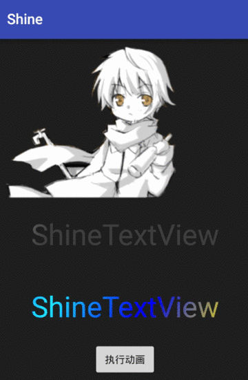

# Shine

a sweep Light lib for ImageView/TextView

gif looks not distinct~;

### JicPack
Add it in your root build.gradle at the end of repositories:

	allprojects {
		repositories {
			...
			maven { url "https://jitpack.io" }
		}
	}
Step 2. Add the dependency

	dependencies {
	        compile 'com.github.luhaoaimama1:Shine:1.01'
	}
    
# Easy use:

Add a ShineImageView/ShineTextView to your layout:

    <zone.com.lightsweep.ShineImageView
        android:id="@+id/abc"
        android:layout_width="match_parent"
        android:layout_height="wrap_content"
        android:src="@drawable/aa"
        app:reflectionColor="#ff0000"
        app:reflectionRorate="30"
        app:reflectionWidth="100" />

    <zone.com.lightsweep.ShineTextView
        android:id="@+id/tv_shine"
        android:layout_width="match_parent"
        android:layout_height="100dp"
        android:text="ShineTextView"
        android:textColor="#444"
        app:reflectionColor="#FFFFFF"
        app:reflectionRorate="30" />
 
###XML attrs;  
  
    <!--default white-->
    <attr name="reflectionColor" format="color"  />
    <!--default view's width-->
    <attr name="reflectionWidth" format="float"/>
    <!--default vertical:0,degree:[0,90)-->
    <attr name="reflectionRorate" format="float"/>
            
###To start the animation:

    //or: shine.setReflectColors(new int[]{Color.RED,Color.YELLOW,Color.BLUE,Color.CYAN},Shader.TileMode.MIRROR);
    s=new ShineAnimator();
    s.setShineView(shine);
    s.start();
  
###To stop it:

    shimmer.cancel();

# Reference&Thanks：

https://github.com/RomainPiel/Shimmer-android